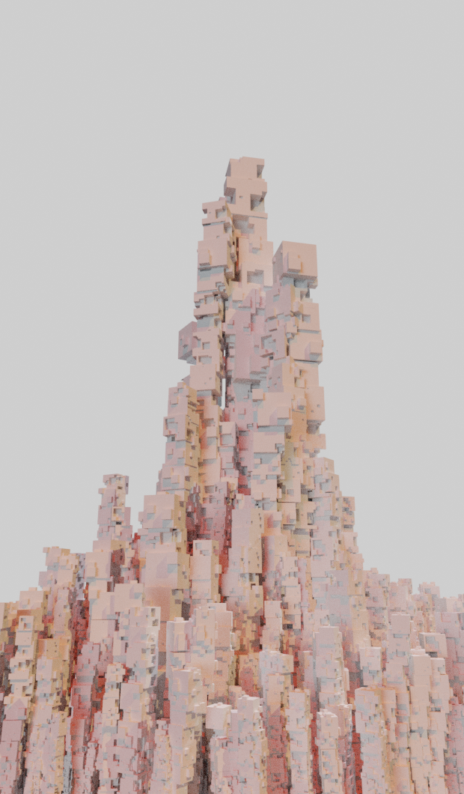
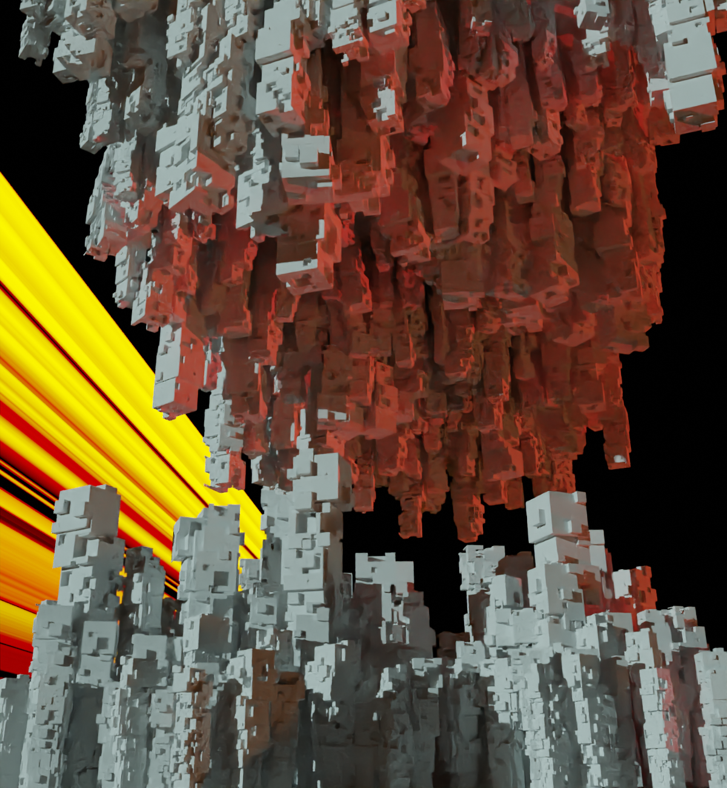
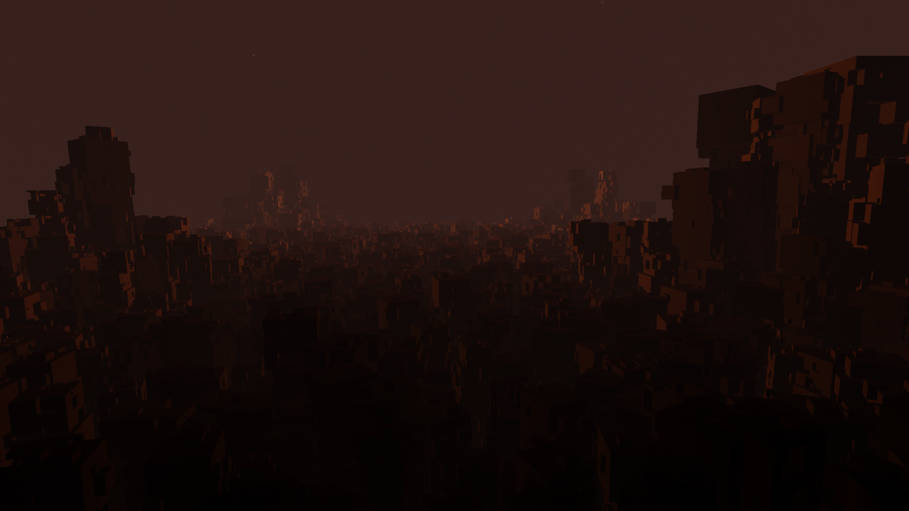
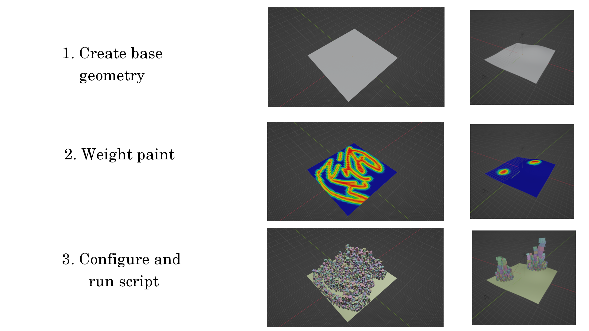

# kubmorph

3D modeling tool for Blender based on Generative art and creative coding.

# Examples

Huge thanks to PolyHaven on HDRIs: https://polyhaven.com/hdris!

More on my Artstation: https://www.artstation.com/lovro

# How to use it

